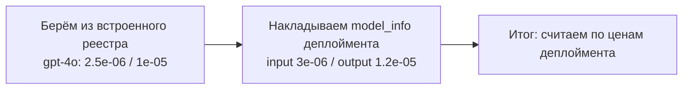

# Цены моделей: откуда берутся

В LiteLLM цена модели определяется **не одним источником**, а цепочкой: встроенный реестр цен → переопределение в деплойменте → модель из админки. Разберём каждый слой.

## Обзор

```mermaid
flowchart TD
    A[Встроенный реестр цен<br/>model_prices_and_context_window_backup.json<br/>2864 модели] --> D[Реестр цен в памяти<br/>litellm.model_cost]
    B[litellm_params / model_info<br/>в конфиге или админке<br/>(input_cost_per_token и др.)] --> D
    C[Модель из админки<br/>LiteLLM_ProxyModelTable в БД] --> D
    D --> E[Расчёт стоимости запроса<br/>cost_calculator.completion_cost]
```

## 1. Встроенный реестр цен (база по умолчанию)

В пакете litellm есть файл `model_prices_and_context_window_backup.json` — реестр на **2864 модели** со стандартными ценами, лимитами контекста и возможностями.

Для каждой модели указано: `input_cost_per_token`, `output_cost_per_token`, `cache_read_input_token_cost`, `max_input_tokens`, `max_output_tokens`, `litellm_provider`, `mode` и флаги возможностей (`supports_vision` и т.д.).

```json
{
  "gpt-4o": {
    "cache_read_input_token_cost": 1.25e-06,
    "input_cost_per_token": 2.5e-06,
    "output_cost_per_token": 1e-05,
    "litellm_provider": "openai",
    "max_input_tokens": 128000,
    "max_output_tokens": 16384,
    "mode": "chat",
    "supports_vision": true
  }
}
```

Цены в реестре — **за один токен** (не за 1М): `$1.50 / 1M` → `1.5e-06`.

## 2. Переопределение цен в деплойменте

Любой деплоймент (из `config.yaml` или из админки) может переопределить цены реестра. Механизм: при создании объекта `Deployment` поля из списка `SPECIAL_MODEL_INFO_PARAMS` **автоматически копируются из `litellm_params` в `model_info`**:

```python
SPECIAL_MODEL_INFO_PARAMS = [
    "input_cost_per_token",
    "output_cost_per_token",
    "input_cost_per_character",
    "output_cost_per_character",
    "cache_read_input_token_cost",
    "cache_creation_input_token_cost",
]
```

Пример в настройках модели (config.yaml или форма в админке):

```yaml
model_list:
  - model_name: my-model
    litellm_params:
      model: gpt-4o
      api_key: os.environ/OPENAI_API_KEY
      input_cost_per_token: 0.000003
      output_cost_per_token: 0.000012
```

Цены, заданные в деплойменте, **перекрывают** значения из встроенного реестра.

## 3. Регистрация в реестре памяти (litellm.model_cost)

При добавлении деплоймента роутер регистрирует его цены в глобальном реестре `litellm.model_cost` через `litellm.register_model()` — **двумя ключами**:

1. Под уникальным `model_info.id` деплоймента.
2. Под общим ключом `custom_llm_provider/model` (например `openai/gpt-4o`) — без ценовых полей, чтобы не затирать глобальные цены для других деплойментов с тем же именем модели.

## 4. Итоговая цена: порядок наложения

При обработке запроса роутер собирает финальный `model_info`:

1. Берёт запись из встроенного реестра по имени модели (`litellm.get_model_info()`).
2. **Поверх накладывает** `model_info` деплоймента (то, что пришло из админки или конфига).



Если в деплойменте цена не задана — используется значение из встроенного реестра.

## 5. Цены у моделей, созданных в админке

Модель, созданная через раздел **Models** в админ-панели при `store_model_in_db: true`, сохраняется в таблицу `LiteLLM_ProxyModelTable` в Postgres со своими `litellm_params` и `model_info`. При старте прокси такие модели загружаются из БД как обычные деплойменты — и их цены проходят тот же путь: регистрация в `litellm.model_cost` + наложение на реестр.

Форма добавления модели в админке позволяет указать ценовые поля прямо в `litellm_params` (раздел ценообразования в форме модели).

## 6. Как цена используется при расчёте

Функция `cost_calculator.completion_cost()` считает стоимость каждого запроса по формуле:

```
cost = prompt_tokens × input_cost_per_token
     + completion_tokens × output_cost_per_token
     + cache_read_tokens × cache_read_input_token_cost
     + cache_creation_tokens × cache_creation_input_token_cost
```

Для моделей с расширенными ценами (аудио, изображения, видео, reasoning) используются соответствующие поля (`input_cost_per_audio_token`, `output_cost_per_image` и т.д.). Полный список ценовых полей: в разделе Models → «Ценообразование».

## Итого: что перекрывает что

| Источник | Приоритет |
| -------- | --------- |
| Встроенный реестр (`model_prices_and_context_window_backup.json`) | Базовый, самый низкий |
| Цены в `litellm_params` деплоймента (из конфига или админки) | Выше реестра |
| Цены в `model_info` деплоймента | Равнозначны `litellm_params` (копируются автоматически) |

Правило простое: **цена из настроек модели всегда важнее цены из встроенного реестра.**