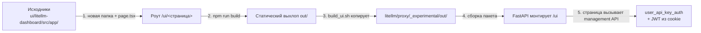

# Админ-панель LiteLLM

Встроенный веб-интерфейс управления LiteLLM, доступный по адресу `/ui`. Панель позволяет управлять ключами, моделями, бюджетами, пользователями и следить за расходами.

## Технологический стек

- **Фронтенд** — Next.js (статическая сборка в `litellm/proxy/_experimental/out/`), монтируется FastAPI на `/ui`.
- **Бэкенд** — Python, FastAPI. Management-эндпоинты в `litellm/proxy/management_endpoints/`.
- **База данных** — PostgreSQL через Prisma ORM.

## Разделы панели

| Раздел | Описание |
| ------ | -------- |
| [Users](admin-users.md) | Внутренние пользователи: роли, создание, бюджеты |
| [Teams](admin-teams.md) | Группировка пользователей, общие бюджеты и модели |
| [Organizations](admin-organizations.md) | Верхний уровень иерархии, владеет командами |
| [API Keys](admin-keys.md) | Виртуальные ключи доступа |
| [Models](admin-models.md) | Регистрация и управление LLM-моделями |
| [Budgets](admin-budgets.md) | Лимиты расходов |
| [Logs](admin-logs.md) | Логи запросов |
| [Settings](admin-settings.md) | Настройки UI, SSO, дефолтные параметры |
| [Usage](admin-usage.md) | Расходы и аналитика |
| [Model / Key / MCP / Team / User Activity](admin-model-activity.md) | Отслеживание использования по каждому измерению |

## Вход и права доступа

### Вход

Страница входа — `/ui/login`. Логин через `UI_USERNAME` + `UI_PASSWORD` (или email+пароль пользователя из БД). При успехе браузер получает JWT-cookie `token`, подписанную `master_key`.

### Роли

LiteLLM использует ролевую модель из семи ролей, разделённых на три группы: администраторы, внутренние пользователи и внешние аккаунты. Роли определены в `litellm/proxy/_types.py` → `LitellmUserRoles`. При входе в панель роль присваивается автоматически: вход админа (`UI_USERNAME`/`UI_PASSWORD`) даёт `PROXY_ADMIN`, вход через email+пароль — роль пользователя из базы данных.

**Администраторы:**

| Роль | Значение | Права |
| ---- | -------- | ----- |
| **PROXY_ADMIN** | `proxy_admin` | Полный доступ ко всему: любые ключи, модели, пользователи, команды, организации, настройки, весь расход |
| **PROXY_ADMIN_VIEW_ONLY** | `proxy_admin_viewer` | Вход в панель, просмотр всех ключей и всего расхода, без возможности создавать или изменять |
| **ORG_ADMIN** | `org_admin` | Администратор своей организации: создаёт команды и пользователей только внутри неё, видит расход своей организации |

**Внутренние пользователи:**

| Роль | Значение | Права |
| ---- | -------- | ----- |
| **INTERNAL_USER** | `internal_user` | Вход в панель, создание/обновление/удаление **собственных** ключей, просмотр своего расхода |
| **INTERNAL_USER_VIEW_ONLY** | `internal_user_viewer` | Вход в панель, просмотр своих ключей и своего расхода, без изменений |

**Внешние аккаунты:**

| Роль | Значение | Права |
| ---- | -------- | ----- |
| **TEAM** | `team` | Командный доступ через JWT-аутентификацию (для сервис-сервис интеграций) |
| **CUSTOMER** | `customer` | Внешние конечные пользователи (end users) |

#### Что видит каждая роль

| Возможность | PROXY_ADMIN | VIEW_ONLY | ORG_ADMIN | INTERNAL_USER | USER_VIEW_ONLY |
| ----------- | :-: | :-: | :-: | :-: | :-: |
| Создание/удаление ключей | ✅ | ❌ | свои команды | свои | ❌ |
| Просмотр ключей | все | все | свои команды | свои | свои |
| Создание пользователей/команд | ✅ | ❌ | только в своей организации | ❌ | ❌ |
| Управление моделями и бюджетами | ✅ | ❌ | ❌ | ❌ | ❌ |
| Управление настройками (UI, SSO) | ✅ | ❌ | ❌ | ❌ | ❌ |
| Просмотр расхода | весь | весь | своей организации | свой | свой |
| Блокировка/разблокировка | ✅ | ❌ | ❌ | ❌ | ❌ |

На UI при создании пользователя доступны только четыре роли: `proxy_admin`, `proxy_admin_viewer`, `internal_user`, `internal_user_viewer`. Остальные роли выставляются через API или JWT-маппинг.

#### JWT-аутентификация и маршруты

Для JWT-токенов LiteLLM поддерживает тонкую настройку доступа через `allowed_routes` в конфигурации (`litellm/proxy/_types.py` → `LiteLLMSettings`):

| Маршрут | Что открывает |
| ------- | ------------- |
| `management_routes` | Все management-эндпоинты (`/key/*`, `/user/*`, `/model/*`, `/budget/*`, `/team/*`) |
| `spend_tracking_routes` | Расходы по ключам/пользователям (`/spend/*`) |
| `global_spend_tracking_routes` | Глобальные расходы (`/global/*`) |
| `info_routes` | Информация: `/model/info`, `/v1/models` |
| `openai_routes` | OpenAI-совместимые LLM-маршруты (`/v1/chat/completions` и др.) |
| `mcp_routes` | MCP-эндпоинты |
| `public_routes` | Публичные маршруты |

По умолчанию: админ JWT получает `management_routes` + `spend_tracking_routes` + `global_spend_tracking_routes` + `info_routes`; командный JWT — `openai_routes` + `info_routes` + `mcp_routes`; публичный неизвестный токен — только `public_routes`. Для JWT также доступны маппинги ролей (`role_mappings`), областей (`scope_mappings`) и принудительный RBAC (`enforce_rbac`).

#### Иерархия бюджета

Проверка лимитов идёт по цепочке независимо от роли: **ключ → пользователь → команда → организация**. Ограничения суммируются сверху вниз: ключ не может потратить больше, чем позволяет бюджет любого уровня, к которому он привязан. `max_budget = 0` запрещает расход полностью; безлимит — `NULL` (для организации — отсутствие строки бюджета).
## Как добавлять новые страницы

Исходный код панели живёт в репозитории `BerriAI/litellm` в папке `ui/litellm-dashboard/` — это стандартный Next.js (App Router) проект. Установленный пакет содержит только результат сборки, поэтому новый раздел добавляется в исходниках, а не в контейнере.

Шаги:

1. **Создать роут** — папку с `page.tsx` в `src/app/(dashboard)/<имя>/`: путь папки = URL страницы (`/ui/<имя>`). Страницы группируются в layout-группу `(dashboard)`.
2. **Собрать** — `npm install && npm run build` (`build_ui.sh` поднимает нужную версию Node через nvm).
3. **Положить результат в пакет** — скрипт сборки копирует статический выхлоп в `litellm/proxy/_experimental/out/`, откуда он попадает в docker-образ.
4. **Смонтировать** — FastAPI раздаёт папку как есть: `app.mount("/ui", StaticFiles(...))`, роут становится доступен автоматически.
5. **Данные и авторизация** — страница обращается к существующим management-эндпоинтам (`/key/*`, `/user/*`, `/model/*`, `/global/*` и т.д.) с JWT из cookie `token`; доступ проверяет `user_api_key_auth` (роль + бюджет).

Так в коде уже добавлена страница **Usage**: маршрут `new_usage:"usage"` с новой версией страницы, а старая сохранена как `usage:"old-usage"` — можно изучать этот коммит как эталон добавления нового раздела поверх существующего.

## Плюсы и минусы подхода (взять ли за основу)

### Плюсы

- **Готовая полноценная панель из коробки.** Логин, роли, CRUD ключей/моделей/пользователей/бюджетов, аналитика — всё уже реализовано и работает. Не нужно проектировать с нуля.
- **Полные исходники фронтенда доступны.** В репозитории [`BerriAI/litellm`](https://github.com/BerriAI/litellm) лежит исходный Next.js-проект `ui/litellm-dashboard/` (`src/app/`, `components/`, `tests/`) — можно форкнуть и пересобрать свою версию панели.
- **Отделяемый UI от бэкенда.** Фронтенд — статическая Next.js-сборка, бэкенд — чистые management-эндпоинты FastAPI с авторизацией через `user_api_key_auth`. Можно переписать фронт, не трогая логику.
- **Единая модель данных.** Одна база PostgreSQL: таблицы ключей, пользователей, команд, организаций, бюджетов, логов расходов и daily-агрегатов. Аналитика и биллинг строятся на одних и тех же данных.
- **Богатая аналитика.** Usage (расходы, токены, запросы), Activity по моделям/ключам/командам/пользователям/MCP, логи запросов, AI-ассистент по расходам — закрывает большинство потребностей мониторинга.
- **Авторизация на каждый запрос.** `user_api_key_auth` проверяет ключ, роль, бюджет и доступ к маршруту на каждом вызове — защита встроена в единую точку, а не дублируется.
- **Гибкая ролевая модель + JWT-маршруты.** Роли администраторов/пользователей/команд, `allowed_routes`, `role_mappings`, RBAC — можно адаптировать под свои сценарии.
- **Расширяемость эндпоинтов.** Добавление своего эндпоинта — это обычный FastAPI-роут с проверкой `user_api_key_auth`; UI имеет систему страниц (вкладки Usage — хороший пример того, как добавляются новые разделы).
- **Активное развитие и совместимость с upstream.** Цены, модели и спецификации провайдеров обновляются; интеграция с OpenWebUI и другими шлюзами уже отработана.

### Минусы

- **Кастомизация фронта требует своей сборки.** В установленном пакете лежит только собранная статика (`proxy/_experimental/out/`), а исходники Next.js живут отдельно в репозитории. Любая правка страниц — это форк, своя `npm run build` и пересборка при каждом апгрейде LiteLLM.
- **Брендирование без сборки ограничено.** Логотип, тема и названия меняются через настройки; глубокая перестройка страниц без пересборки исходников не делается.
- **Большой монолит.** Вся логика в `proxy_server.py` (свыше 16 000 строк) + management-эндпоинты. Разобраться в отдельных сценариях можно, но масштабно править поведение рискованно.
- **Смешение ролей и ответственности.** Один сервис выполняет и проксирование LLM-запросов, и администрирование. Перегрузка одной части влияет на другую; нет изоляции между управлением и прохождением трафика.
- **Enterprise-функции платные.** Часть возможностей (детальные отчёты, продвинутые guardrails, политики) закрыта лицензией; базовый UI их просто скрывает.
- **Кастомизации живут только в патчах.** Изменения поведения (например, свои обработчики ответов картинок) требуют патчинга кода пакета, который слетает при обновлении образа.
- **Безопасность cookie сессии.** JWT-кука без `HttpOnly`/`Secure`; сессия фиксированной длительности без refresh-токена. При выносе на прод требует доработки.
- **UI привязан к конкретной версии.** Страницы и эндпоинты меняются между версиями; кастомные интеграции с UI надо поддерживать при апгрейдах.
- **Онлайн-кастомизация ограничена.** Нельзя добавить свою страницу/отчёт «из коробки» через конфиг — только свой фронтенд поверх тех же API.

### Вывод

LiteLLM-админка — **хорошая основа для старта**: модель данных, ролевая модель, API и аналитика уже проработаны и проверены в продакшене. Реалистичный сценарий: взять за основу бэкенд и схему данных, а поверх них строить собственный UI/функционал, если нужны специфические бизнес-сценарии (кастомные отчёты, брендинг, интеграции). Основные вложения понадобятся в: переписывание/доработку фронтенда, безопасность сессии, enterprise-возможности и стабильность кастомизаций при обновлениях.
