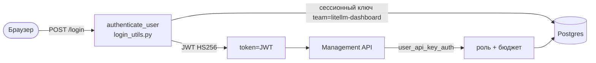

# Админ-панель LiteLLM

Встроенный веб-интерфейс управления LiteLLM, доступный по адресу `/ui`. Панель позволяет управлять ключами, моделями, бюджетами, пользователями и следить за расходами.

## Технологический стек

- **Фронтенд** — Next.js (статическая сборка в `litellm/proxy/_experimental/out/`), монтируется FastAPI на `/ui`.
- **Бэкенд** — Python, FastAPI. Management-эндпоинты в `litellm/proxy/management_endpoints/`.
- **База данных** — PostgreSQL через Prisma ORM.

## Разделы панели

| Раздел | Описание |
| ------ | -------- |
| [Users](admin-users.md) | Внутренние пользователи: роли, создание, бюджеты |
| [Teams](admin-teams.md) | Группировка пользователей, общие бюджеты и модели |
| [Organizations](admin-organizations.md) | Верхний уровень иерархии, владеет командами |
| [API Keys](admin-keys.md) | Виртуальные ключи доступа |
| [Models](admin-models.md) | Регистрация и управление LLM-моделями |
| [Budgets](admin-budgets.md) | Лимиты расходов |
| [Logs](admin-logs.md) | Логи запросов |
| [Settings](admin-settings.md) | Настройки UI, SSO, дефолтные параметры |
| [Usage](admin-usage.md) | Расходы и аналитика |
| [Model / Key / MCP / Team / User Activity](admin-model-activity.md) | Отслеживание использования по каждому измерению |

## Вход и права доступа

### Вход

Страница входа — `/ui/login`. Логин через `UI_USERNAME` + `UI_PASSWORD` (или email+пароль пользователя из БД). При успехе браузер получает JWT-cookie `token`, подписанную `master_key`.

### Роли

| Роль | Права |
| ---- | ----- |
| **PROXY_ADMIN** | Полный доступ ко всему |
| **PROXY_ADMIN_VIEW_ONLY** | Просмотр без изменений |
| **ORG_ADMIN** | Управление своей организацией |
| **INTERNAL_USER** | CRUD собственных ключей, свой расход |
| **INTERNAL_USER_VIEW_ONLY** | Просмотр своего расхода |
| **TEAM** | Командные ключи (JWT) |
| **CUSTOMER** | Внешние клиенты |